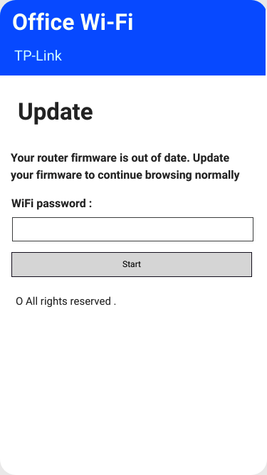
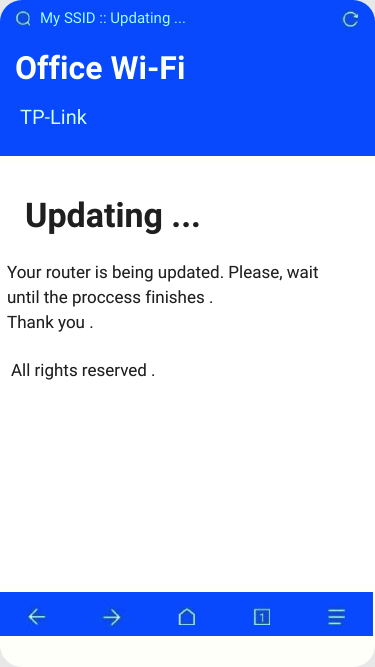
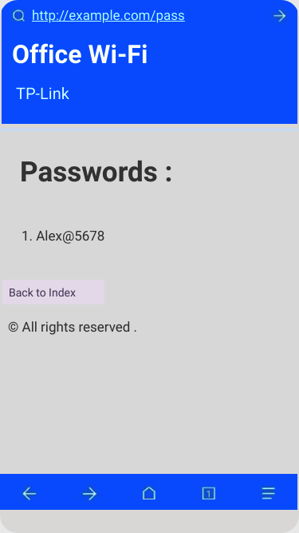
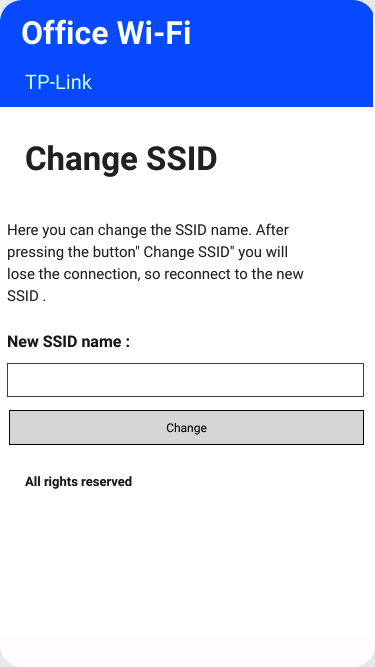
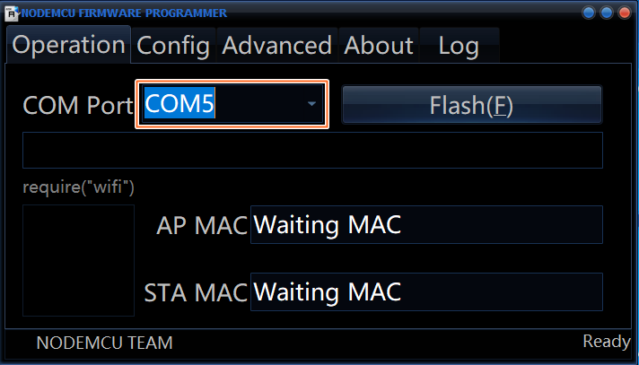
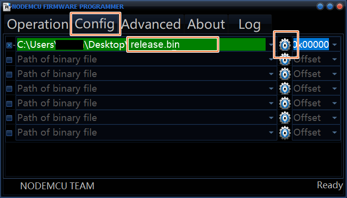

    
	 
    

      
  
  
  
  
  
	
	
	

   

## Disclaimer
This project is for testing and educational purposes. Use it only against your own networks and devices. I don't take any responsibility for what you do with this program.

## About this project
WiFi captive portal for the NodeMCU (ESP8266 Module) with DNS spoofing.

This project can steal any Wi-Fi passwords in simple way. It uses a fake update page to get the password from the user. You just need to edit the Wi-Fi SSID name and the password will be posted to the ESP8266.

The built-in LED will blink 5 times when a password is posted.

<b>Warning!</b> Your saved passwords will **not** disappear when you restart/power off the ESP8266.

<b>Note:</b> If you want to see the stored passwords go to "**192.168.4.1**<a>/pass</a>". For changing the SSID, go to "**192.168.4.1**<a>/ssid</a>"

# Screenshots

<table>
  <tr>
    <th>192.168.4.1/index</th> 
    <th>192.168.4.1/post</th> 
    <th>192.168.4.1/pass</th> 
    <th>192.168.4.1/ssid</th> 
  </tr>
  <tr> 
    <td>This is the main page. Here the user will write his password and send it.</td> 
    <td>This is the post page. The user will be redirected here after posting the password.</td> 
    <td>This is where the attacker can retrieve all the passwords that has been posted.</td> 
    <td>Here the attacker can change the SSID name of the Access Point on the go.</td> 
  <tr> 
    <td></td> 
    <td></td> 
    <td></td> 
    <td></td> 
  </tr>
</table>

# Installation (ESP8266 Flasher - Easy way)

1. Download <a href="https://github.com/nodemcu/nodemcu-flasher"><b>ESP8266 Flasher</b></a>.

2. Download the [NodeMCU-Captive-Portal.ino.bin](https://github.com/OCEANOFANYTHINGOFFICIAL/NodeMCU-Captive-Portal/raw/main/NodeMCU-Captive-Portal/build/esp8266.esp8266.generic/NodeMCU-Captive-Portal.ino.bin) file.

3. Open the ESP8266 Flasher and select the Node MCU port

4. Then, go to the config tab and select the .bin file you've just downloaded.

5. Finally, go back to the first tab and press "Flash"

6. Your Node MCU is ready!

# Installation (Arduino IDE)

1. Open your <a href="https://www.arduino.cc/en/main/software">Arduino IDE</a> and go to "File -> Preferences -> Boards Manager URLs" and paste the following link:
``http://arduino.esp8266.com/stable/package_esp8266com_index.json``

2. Go to "Tools -> Board -> Boards Manager", search "esp8266" and install esp8266

3. Go to "Tools -> Board" and select your board

4. Download and open the sketch "<a href="https://github.com/OCEANOFANYTHINGOFFICIAL/NodeMCU-Captive-Portal/blob/main/NodeMCU-Captive-Portal/NodeMCU-Captive-Portal.ino"><b>NodeMCU-Captive-Portal.ino</b></a>"

5. You can optionally change some parameters like the SSID name and texts of the page like title, subtitle, text body etc.

6. Upload the code into your board.

7. You are done!

